I always enjoy getting tips from friends about great apps or services they use, so this post is about what apps I really like and use. 

### My favorite productivity apps: 

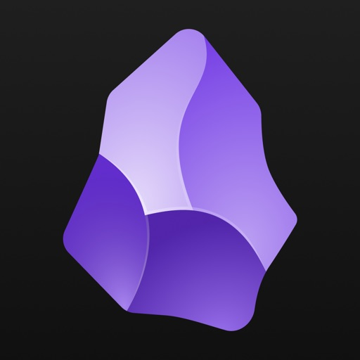

**Obsidian** (MacOS, iOS) (free)  I take a lot of notes and I save a lot of information, snippets from books, pod transcripts etc. I need a place to dump all my notes and thoughts to easily find them again. I’ve used other personal wikis before and Obsidian is my current favorite. You can tag, cross-reference between notes etc. Obsidian is great for this, and it’s possible to keep a vault in iCloud to sync between devices. Highly recommended. 

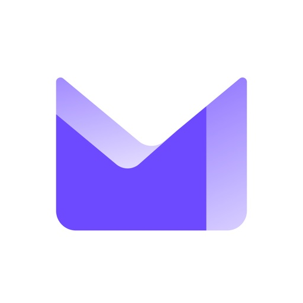

**Proton mail + drive** (Web, iOS) (subscription)  *"If you’re not paying, you are the product".* With Google making some questionable decisions lately, many are looking for an alternative. I have been using Proton mail for a while and am happy with this European privacy centered alternative. I especially like that the cheapest mail account includes 10 e-mail aliases. This makes it much easier to have a separate e-mail for all those signups and apps where you don’t want to give them your real info or expect spam. I have several gmail addresses for this purpose, but Proton makes it so much easier. I haven’t really started using their calendar yet, but will slowly migrate to that too. You can start off with a free Proton Mail-account to try it out. I will sadly be stuck with keeping Gmail for a while longer since there are lots of Google drive shares, and Google Meet meetings, but I've moved all important accounts to Proton. 

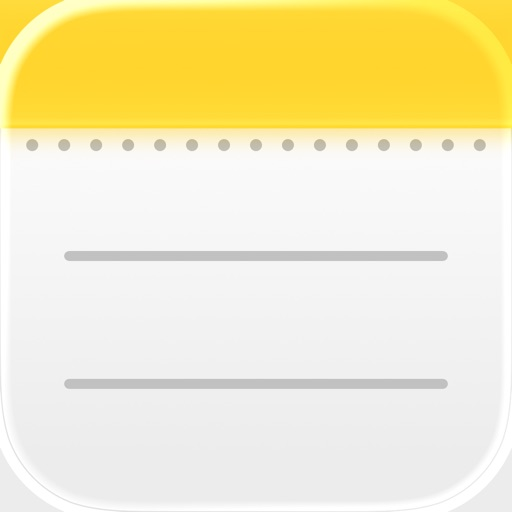

**Notes** (MacOS, iOS) (built-in)  Yes, really. The built in Notes in iOS and MacOS, syncs over iCloud and makes it easy to have notes cross-platform. I use it for quick and easy notes, book lists, shopping lists, everything that I want easily accessible and searchable, when I don't need tags or grouping. 

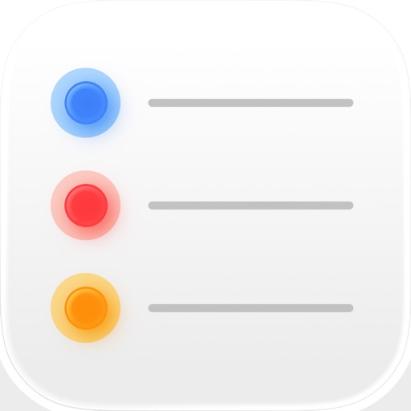

**Reminders** (MacOS, iOS) (built-in)  Simple reminders cross-platform. I’ve used so many different todo-lists in the past. Trello was a big favorite for me but quickly became too crowded with all my todos, ideas, links and stuff for the future. I try to keep reminders to just urgent things and repeating things, “Sign up for skiing trip" Tuesday 14:00, but also repeating reminders such as “Check bills” every month. You can trigger reminders according to location and set alarms as well. 

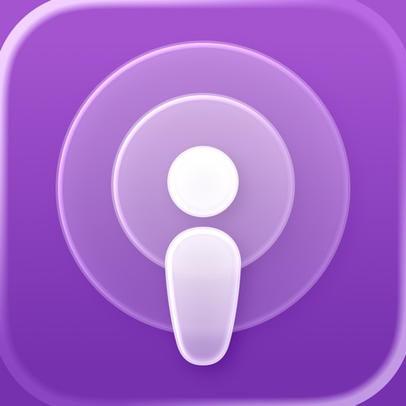

**Apple Podcast** (MacOS, iOS) (free)  My podcast app of choice. I usually listen to podcasts when commuting and get through quite a few every week. Podcasts is easy to use and I save specific episodes I want to listen to later so I have a long queue with interesting ones. I very often go into transcripts while listening and copy interesting parts to reference/check later. 

### AI tools 

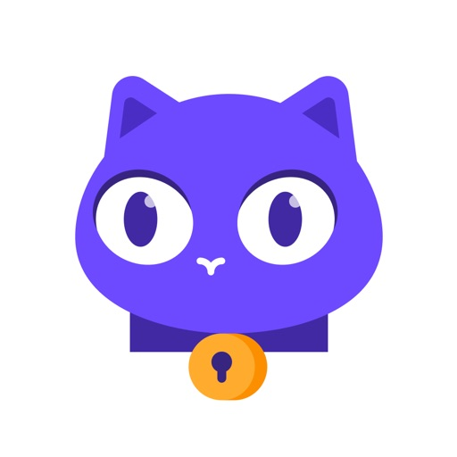

**Proton Lumo** (Web, iOS) (free or Pro)  Lumo is a confidential AI chat bot and my favorite. I like Lumo not only for the cute cat mascot, but also that it won’t save all your information and use it against you in the future. It’s not as advanced as many other competitors and it's not available in Swedish yet (but in 10 other languages).   I like that it’s default personality is helpful without being overly friendly and flattering, no “That is such a brilliant question, you’re really special!” but straight to the point and helpful answers with clear TLDR:s at the end. When I want to figure something out, Lumo is always my first choice. 

**Cursor** (MacOS) (subscription)  My vibe coding tool of choice. I haven't used other tools extensively, so I can't compare them (yet). Cursor is easy to use, pragmatic and I like the different modes (Ask, Agent, Plan, Debug). I also think that it has a fair pricing for personal projects like mine. 
 

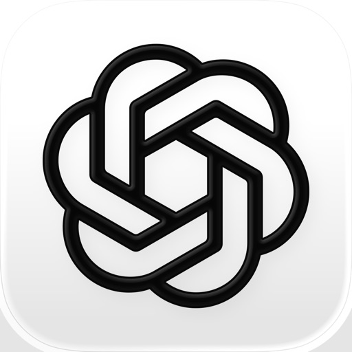

**ChatGPT** (Web, MacOS, iOS) (free, subscription)  The chatbot I use for figuring things out, creating material for my kids school work (French word lists etc) since it can answer in Swedish. I wish it could be limited to only checking Swedish sources better, I don’t trust information about what exactly is true in Sweden. Mostly used for generating simple images, to my blogposts for example. 

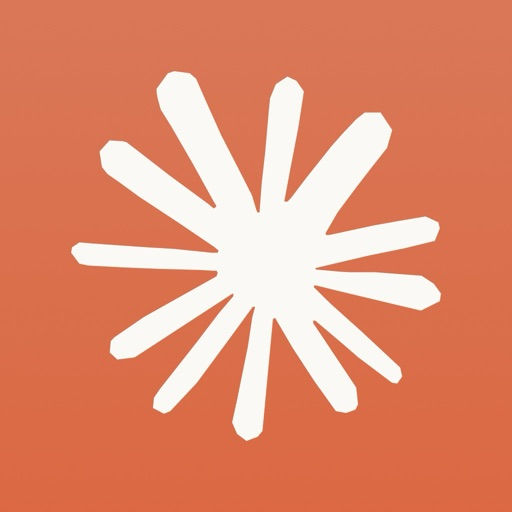

**Claude** (Web, MacOs, iOS) (free, subscription)  I'm trying out Claude for some things but I’m not on the hype train (yet?). I'm only trying out the free version, so it's quite limited.
  

### Web 

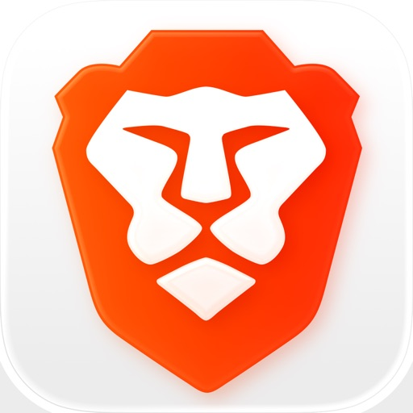
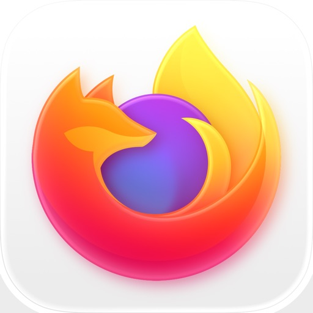

**Brave** and **Firefox** (MacOS, iOS) (free)  Great web browsers with focus on privacy. I use both Brave and Firefox for different purposes. 

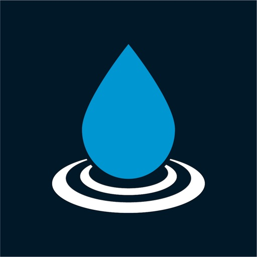

**Raindrop.io** (Browser extension, iOS) (subscription)  Raindrop is a cross platform bookmark manager with tags, folders etc.  I gather news articles, blogg posts, research papers etc like a real information hoarder. This is how I organize everything so I can find them later. I’m a little bit concerned about the privacy aspects, but this has been the best option so far. 

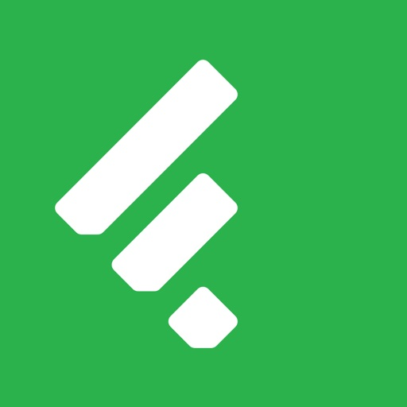

**Feedly** (Web, iOS) (subscription)  I read lots of news and blogs and RSS is still king. Feedly is an easy to use RSS-reader that I’ve used for years. There might be better options out there, but I haven’t felt the need to research competitors. 

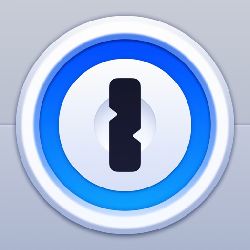

**1Password** (Web, iOS, MacOS) (subscription)  Everyone should have some kind of password manager, I have always been very careful to use unique passwords everywhere. I used LastPass earlier but after a breach, I switched to 1password (very easy to switch). I have a lot of logins and this makes it bearable. Easy to use and easy to have a shared vault with your partner/friend as well for shared logins. 

### Communication

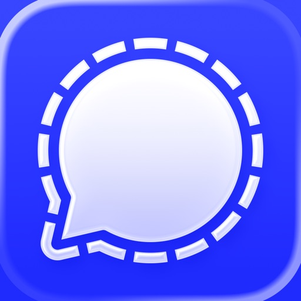

**Signal** (MacOS, iOS) (free)  Privacy centered and encrypted, easy to use, great for group chats and communication with friends on both iPhone and Android, from desktop as well as phone. 

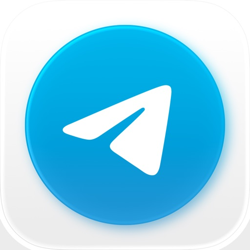

**Telegram** (MacOS, iOS) (free)  Also easy to use. I moved most of my conversations over to Signal since it’s even more privacy centered, and because the founder of Telegram seems a bit… odd. 

### Fun and hobby

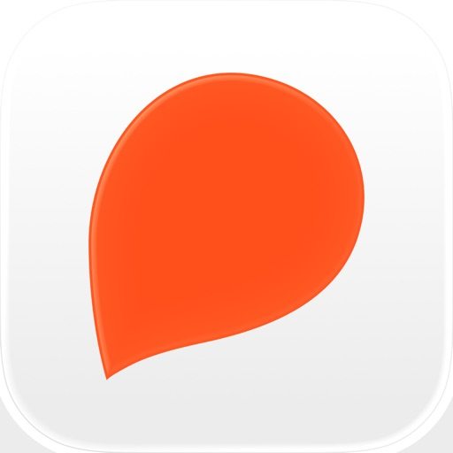

**Storytel** (iOS, tablet) (subscription)  I use Storytel mostly for e-books and read them on the Storytel tablet I have. I like that I have unlimited books in my subscription since I usually want to read many more books than I actually have the time for. I can try a book and just switch to a better one without having spent money or going through the hassle of returning it (Kindle). I sometimes listen to an audio book as well, but not often. 

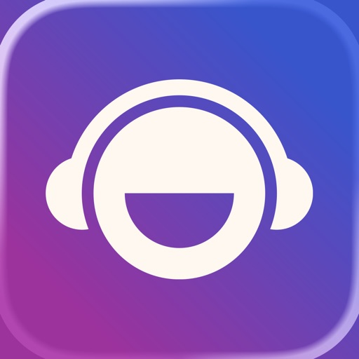

**Brain.fm** (Web, iOS) (subscription)  This is a simple app with background music for focus. It has different types of music and music for different kinds of focus (learning, motivation, creativity etc). I was hesitant to pay a monthly subscription for this app, but finally took the leap when they had a great Black Friday deal. I very seldom sit with headphones on at work but it has been great for vibe coding or learning stuff. An extra bonus is that my son loves it and always uses it when he’s studying.  

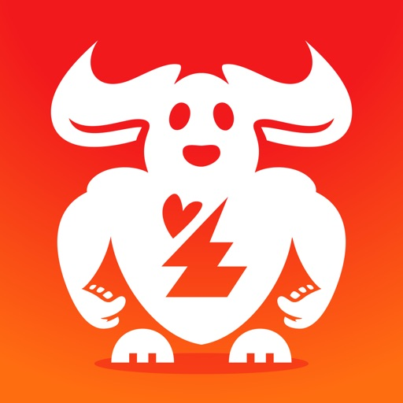

**Strengthlog** (iOS) (free, subscription)  The best training app. Log and create strength training workouts or programs. Contains instructions for lots of exercises. You can follow your progress and see PR's and statistics. I have the paid version and have used it for years. They also have a great <a href="https://www.strengthlog.com/podcast/"> podcast</a> about strength training where they go through the latest science as well as their own tips and tricks. 

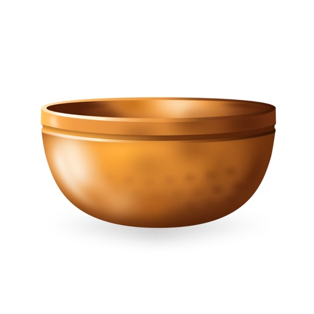

**Insight timer** (iOS) (free, subscription)  Great meditation app, with simple options like a timer, but also recorded meditations from several of my favorite teachers (over 300k meditations). Very generous free option. I have a subscription since several years back.

**Finch** (iOS) (free, subscription)  A cute little app for self-care. You set up and log daily goals and take care of a small bird.   

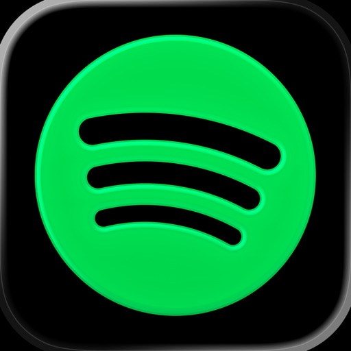

**Spotify** (MacOS, iOS) (subscription)  Everyone needs music. Also works well on my Sonos speakers at home. 
  

### Photography 

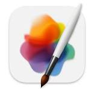

**Pixelmator** (MacOS) (one-time purchase)  With Adobe turning everything into very expensive subscriptions, this is my image editing app of choice. It’s quite good with lots of tools you expect. I’m sure there are even better alternatives out there. 

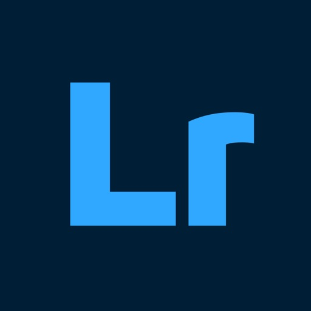

**Lightroom** (MacOS) (subscription)  Sadly a yearly Adobe subscription and no app purchase but it’s amazing for editing photos. I take a lot of pictures and create photo books and prints and this is the best tool I’ve tried for adjusting white balance, colors and exposure and the denoise feature for removing ISO noise is amazing. I only use it for a few weeks per year when I go through all my photos and I have all my photos locally and am completely uninterested in using their cloud, so I’m quite annoyed that I have to pay a yearly subscription that includes cloud storage. 

### My own apps of course

**LearningBadger**   I've written about this app <a href="https://sofiakodar.github.io/posts/learningbadger/">here</a>. Only available in Testflight for my beta testers so far. 
  

**TravelBadger**   I've written about this app <a href="https://sofiakodar.github.io/posts/travelbadger/">here</a>. Only available in Testflight for my beta testers so far. 
  

### What have I missed?
Do you have any tips, maybe the perfect app that I would like? Please let me know!

*Most of these apps have an Android app as well, but since I don't use any Android devices I haven't checked.*